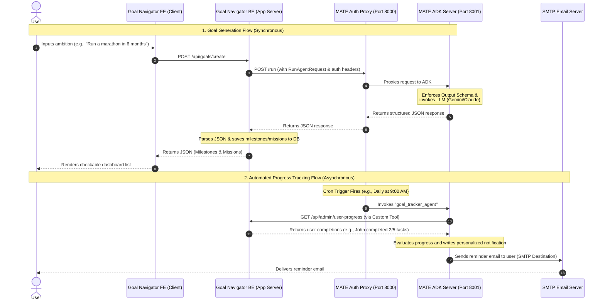

# MATE Integration Proposal for GoalNavigator.ai

This document outlines the detailed architecture, integration patterns, and communication flows to use MATE (Multi-Agent Tree Engine) as the production-ready AI backend for [GoalNavigator.ai](https://goalnavigator.ai/).

---

## 1. System Architecture Diagram

Below is the high-level architecture showing how the **Goal Navigator App** interacts with **MATE** as a pure JSON AI Engine, including both synchronous user-facing requests and background tracking workflows.



---

## 2. Front-End and Back-End API Communication (JSON format)

To establish a pure JSON integration, Goal Navigator will bypass MATE's default chat widget and communicate directly with MATE’s REST API proxy.

### A. Authentication
All requests from the Goal Navigator backend to MATE must include HTTP Basic Authentication or Bearer Token authentication based on MATE credentials:
* **Headers**: 
  ```http
  Authorization: Basic <base64(AUTH_USERNAME:AUTH_PASSWORD)>
  ```
  *(Default development credentials: `admin:mate`)*

### B. Synchronous Goal Generation (`POST /run`)
When a user defines a goal, Goal Navigator makes a POST request to MATE's `/run` endpoint. This is a non-streaming endpoint that returns the complete list of events and final output in a single JSON payload.

* **API Endpoint**: `POST https://your-mate-instance.com/run`
* **JSON Request Body**:
  ```json
  {
    "app_name": "goal_generator_agent",
    "user_id": "gn_user_12345",
    "session_id": "gn_session_goal_67890",
    "new_message": {
      "role": "user",
      "parts": [
        {
          "text": "I want to run a marathon in 6 months. I am a beginner. Target deadline: 2026-12-08. Priority: High."
        }
      ]
    },
    "streaming": false
  }
  ```
* **MATE Response Format**:
  MATE returns a list of events. The final event containing the text output can be parsed directly by the backend:
  ```json
  [
    {
      "event_id": "...",
      "author": "goal_generator_agent",
      "content": {
        "parts": [
          {
            "text": "{\n  \"goal_name\": \"Beginner Marathon Training\",\n  \"description\": \"6-month training plan for a beginner to complete a marathon.\",\n  \"milestones\": [\n    {\n      \"title\": \"Base Building\",\n      \"target_week\": 4,\n      \"missions\": [\n        {\n          \"title\": \"Easy Runs\",\n          \"description\": \"Run 3 times a week for 30 minutes at a conversational pace.\"\n        }\n      ]\n      ...\n    }\n  ]\n}"
          }
        ]
      }
    }
  ]
  ```

---

## 3. Structured Outputs with Output Schema Validation

To guarantee that the front-end always receives clean JSON that fits the Goal Navigator UI model, we can leverage MATE's built-in **`output_schema`** field. 

When you configure the `goal_generator_agent` in the MATE dashboard, you should define its output schema as follows:

```json
{
  "type": "object",
  "properties": {
    "goal_name": {
      "type": "string",
      "description": "Name of the structured goal plan"
    },
    "description": {
      "type": "string",
      "description": "High-level goal description"
    },
    "milestones": {
      "type": "array",
      "items": {
        "type": "object",
        "properties": {
          "title": { "type": "string", "description": "Milestone title" },
          "target_week": { "type": "integer", "description": "Target week number to complete" },
          "missions": {
            "type": "array",
            "items": {
              "type": "object",
              "properties": {
                "title": { "type": "string", "description": "Mission title" },
                "description": { "type": "string", "description": "Details about how to achieve it" }
              },
              "required": ["title", "description"]
            }
          }
        },
        "required": ["title", "target_week", "missions"]
      }
    }
  },
  "required": ["goal_name", "description", "milestones"]
}
```

MATE passes this schema down to the LLM (e.g. Gemini's `response_schema`), enforcing that the response is strictly structured JSON.

---

## 4. Automating Tracking and Email Notifications

MATE's **Trigger Engine** provides the ideal foundation to automate goal tracking and user communication without bloating the core Goal Navigator codebase.

### Option A: Webhook Triggers (Event-Driven)
Whenever a day ends or a user updates their checklist, the Goal Navigator backend fires a MATE Webhook Trigger.

1. **Trigger Configuration**:
   * Create a trigger of type `webhook` in MATE, targeting a `goal_tracker_agent`.
   * Configure the output destination as **`email`**.
   * Configure the output config:
     ```json
     {
       "to": "{{user_email}}",
       "subject": "Goal Navigator — Daily Progress Update"
     }
     ```
2. **Execution**:
   Goal Navigator BE calls:
   ```bash
   curl -X POST "https://your-mate-instance.com/triggers/{trigger_id}/fire?key=<fire_key>" \
     -H "Content-Type: application/json" \
     -d '{"prompt": "User Name: John Doe. Email: john@example.com. Progress today: Completed 3 out of 5 missions. Remaining: Gym Session. Write a motivating daily recap email."}'
   ```
   The `goal_tracker_agent` receives the prompt, formulates the text, and MATE sends it directly via SMTP.

### Option B: Cron Triggers (Scheduled) + Custom Tools
MATE triggers can run autonomously on a schedule using cron expressions.

1. **Trigger Configuration**:
   * Create a trigger of type `cron` in MATE.
   * **Cron Expression**: `0 18 * * *` (Runs daily at 6:00 PM UTC).
   * **Prompt**: `"Retrieve today's progress for active users and send emails to anyone with pending tasks."`
2. **Custom Tool Integration**:
   * Add a custom tool to MATE (`shared/utils/tools/custom_tools.py`):
     ```python
     import httpx
     
     def get_user_progress_report():
         """
         Fetches daily completion stats for all active users from GoalNavigator.ai.
         """
         url = "https://goalnavigator.ai/api/admin/user-progress"
         headers = {"Authorization": "Bearer <internal-secret-token>"}
         try:
             with httpx.Client(timeout=30.0) as client:
                 resp = client.get(url, headers=headers)
                 return resp.json() # Returns lists of users, goals, and daily checklists
         except Exception as e:
             return f"Error fetching progress: {e}"
     ```
   * Register this tool in MATE and attach it to the `goal_tracker_agent`.
   * When the cron triggers:
     - The agent runs `get_user_progress_report()` to fetch the data.
     - The agent checks who is lagging behind.
     - The agent generates personalized motivation tips.
     - The agent emails the reports out or posts them back to Goal Navigator's HTTP endpoint.

---

## 5. Security and Budget Governance

By utilizing MATE as the AI backend, Goal Navigator gains enterprise-grade features for free:

1. **User Scoping**:
   * By passing the specific user ID in the `/run` payload (`"user_id": "gn_user_12345"`), MATE isolates the conversation history and memory blocks for that specific user.
2. **Cost Tracking & Analytics**:
   * MATE logs token usage per request in the `token_usage_logs` table, broken down into prompt tokens, response tokens, and tool-use tokens.
   * Goal Navigator can query the MATE analytics endpoint to display exact AI token usage and costs per user:
     ```
     GET https://your-mate-instance.com/dashboard/api/usage/users
     ```
3. **User Rate Limits & Budgets**:
   * Configure rate limits in MATE's dashboard so a single user cannot abuse the service or cause an unexpected spike in OpenAI/Gemini costs. MATE's `RateLimitMiddleware` automatically blocks requests exceeding quotas.
